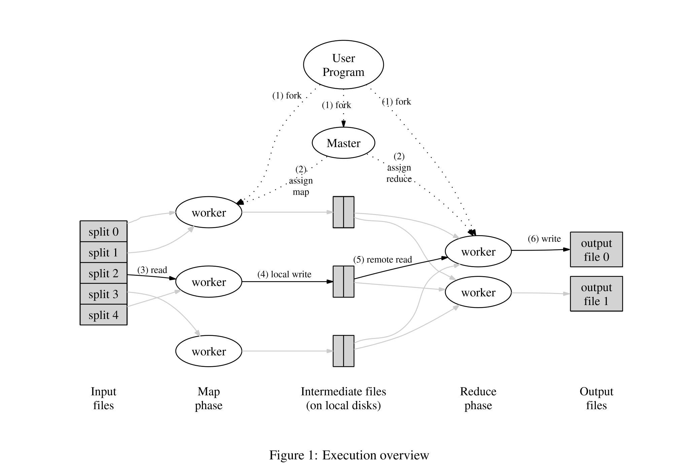
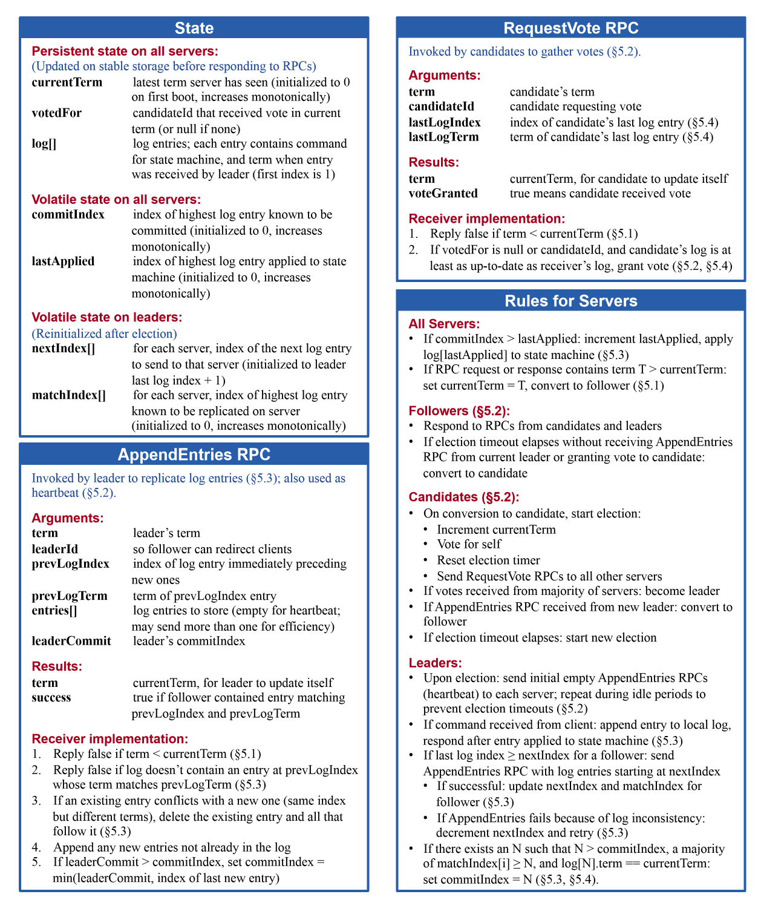

# Distributed Systems Labs

## 0. Preparation

I finished these labs in Visual Studio Code, which has a wonderful [Go extension](https://marketplace.visualstudio.com/items?itemName=golang.go) provided by Google. However if you use VS Code as you editor to do these labs you may find some troubles installing necessary analysing tools such as `gopkgs`. Probably you may get error information like "tcp dial up time out" in mainland China due to a well-known reason, and I solved it in this way:
1. set a proxy for `go get`
```
$ go env -w GO111MODULE=on
$ go env -w GOPROXY=https://goproxy.io,direct
```
2. restart VS Code or terminal 
3. click `install all` button to install go tools in VS Code and this time you  should get message `SUCCEED`
4. IMPORTANT: unset `GO111MODULE`, otherwise you may get trouble running the labs as I did(errors like "could not import 'fmt'...")
```
$ go env -w GO111MODULE=off
```

Also I found this [documentation](https://golang.org/doc/code) useful to understand how a Go programme is built and run

## 1. MapReduce

### Design

The design strictly follows the original MapReduce paper, except that all intermidiate files and output files are stored on 
the single local file system other than a global file system like GFS.




#### 1. master

The master keeps a consistent data structure about all tasks, including their state (`IDLE`, `IN_PROGRESS` or `COMPLETED`) and the number of remaining tasks (`map_remain`, `reduce_remain`)

Each time a worker asks the master for a task, the master checks all tasks and allocate an idle tasks if there exists one.
The master gives the worker a `timestamp` and at the same time the master starts a goroutine, which sleeps for 10 seconds and check the task's `state`: if `COMPLETED` then the task has been performed by the worker successfully; if `IN_PROGRESS` then the master assumes that the worker dies for a certain reason and set `state` to `IDLE`, waiting for another worker to ask for it.

The master will receive a response message via RPC called by the corresponding worker at the time the worker finishes its task. It checks the processing time of the task via the previous given `timestamp`, and if it exceeds 10 seconds the master
assumes the task invalid and ignore this message

Each time the master is informed that a task has been performed, it decreases the remaining count until it reaches 0 and the master exits

#### 2. worker

Each worker periodically asks the master for a task via RPC, and if it gets a task it performs it. If the worker performs the task successfully it will inform the master via RPC.

If the worker fails to connect to the master, it assumes that the master has exited (all tasks have been done or the master has crashed) and exits.

#### 3. concurrent consistency

The master's data structure is accessed concurrently and needs to be protected by mutexes

To ensure the consistency of files in case of crashes during writing, the two-phase trick is implemented: all datas will be written to a temporary file and it will be renamed once it is completely written. The trick ensures all files are written atomically

### Implementation

See `src/mr/master.go` `src/mr/rpc.go`, `src/mr/worker.go`


## 2. Raft

Before writing any code, make sure the original paper of Raft makes sense to you and strictly follow the instructions from figure 2


Also, this [blog from TA](https://thesquareplanet.com/blog/students-guide-to-raft/) helps a lot. It's *Implementing Raft* section relates to this lab and *Applications on top of Raft* section relates to lab 3